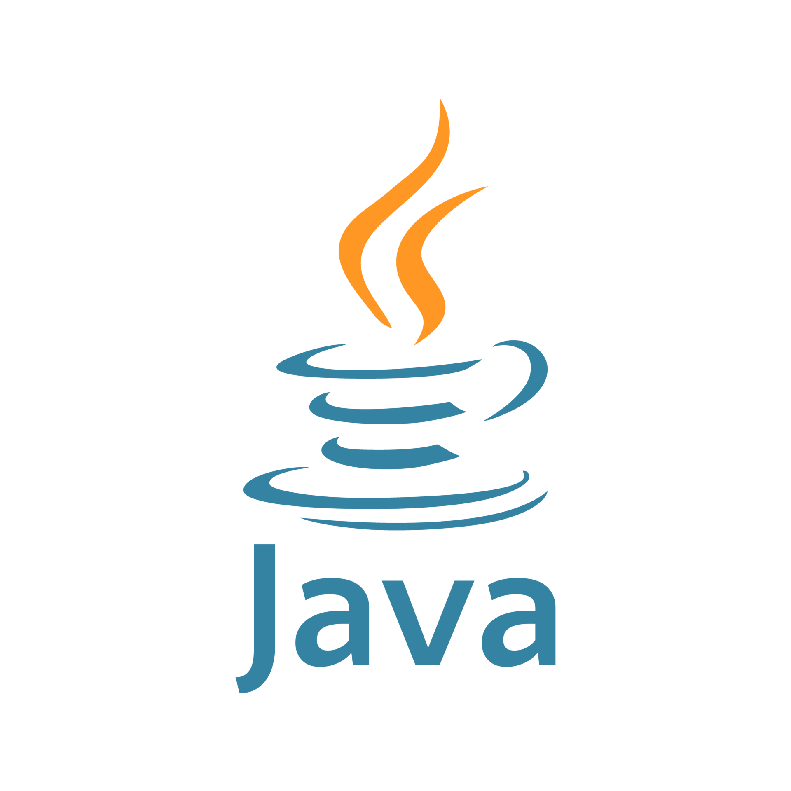

## GERAÇÃO CALDEIRA 
Olá, este é o meu repositório no GitHub onde você pode encontrar todos os exercicios que serão realizados.
Este são os estudos proporcionados pela trilha de programação do Geração Caldeira.
Durante a prática desses exercícios foi desenvolvido:

- `JDK 17`
- `IntelliJ IDEA`
- `Lógica de Programação`
- `Algoritmos Java`
- `Polimorfismo e Herança`
- `Orientação à objetos `
- `Estrutura de dados `
# Índice

* [Aula 01](https://github.com/anitaeverywhere/Java-Caldeira/tree/main/Aula01)
* [Aula 02](https://github.com/anitaeverywhere/Java-Caldeira/tree/main/Aula02)
* [Aula 03](https://github.com/anitaeverywhere/Java-Caldeira/tree/main/Aula03)
* [Aula 04](https://github.com/anitaeverywhere/Java-Caldeira/tree/main/Aula04)
* [Aula 05](https://github.com/anitaeverywhere/Java-Caldeira/tree/main/Aula05/src)
* [Aula 06]()

